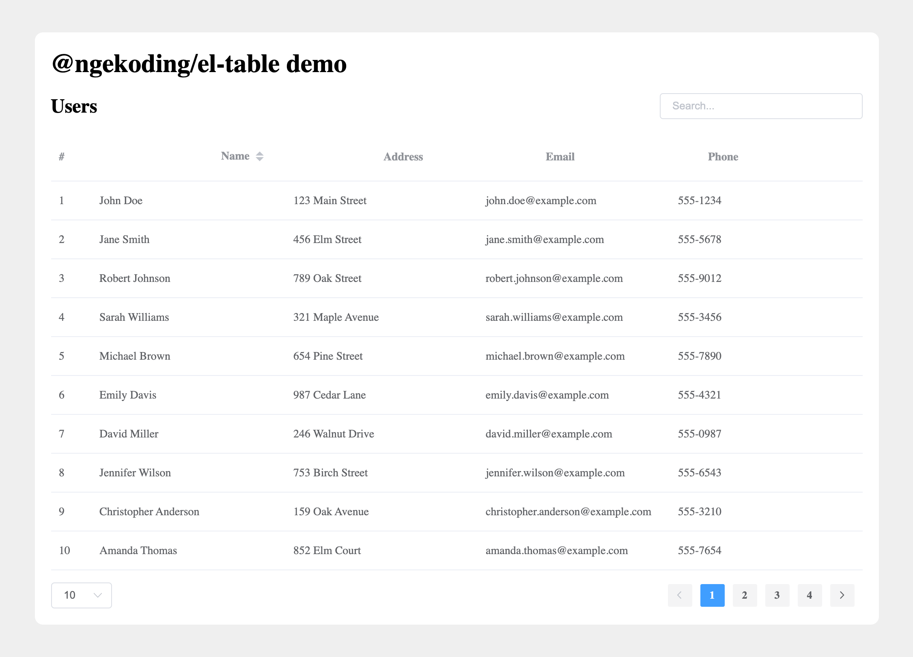

# Improved ElementUI Table Component

Improved ElementUI table component with search, pagination and more.

Features:

- [x] Pagination
- [x] Search
- [x] Row number
- [ ] Remote data



## Installation

You can install the package via npm:

```sh
npm install @ngekoding/el-table
```

Next, you must register the component. The most common use case is to do that globally.

```js
import Vue from 'vue'
import ImprovedElTable from '@ngekoding/el-table'

Vue.use(ImprovedElTable)
```

or register it individually:

```js
import Vue from 'vue'
import IElTable from '@ngekoding/el-table/lib/table'
import IElTableColumn from '@ngekoding/el-table/lib/table-column'

Vue.component(IElTable.name, IElTable)
Vue.component(IElTableColumn.name, IElTableColumn)
```

Note: you are still need to register `element-ui` and import the style, continue reading for complete example.

or for the easiest way, you can use [unplugin-vue-components](https://github.com/antfu/unplugin-vue-components) to auto import the component with it's style:

- Install `unplugin-vue-components`

```sh
npm i unplugin-vue-components -D
```

You can found the detail about this awesome package from the link above.

- Change vite config (check the docs for Webpack, etc...)

```js
// vite.config.js
import Components from 'unplugin-vue-components/vite'
import { ElementUiResolver } from 'unplugin-vue-components/resolvers'
import ImprovedElTableResolver from '@ngekoding/el-table/lib/resolver'

// your plugin installation
Components({
  resolvers: [
    ElementUiResolver(),
    ImprovedElTableResolver(),
  ],
})
```

## Usage

Here's a simple example on how to use the component.

```vue
<script>
import Vue from 'vue'
import ElementUI from 'element-ui'
import ImprovedElTable from '@ngekoding/el-table'

import 'element-ui/lib/theme-chalk/index.css'

Vue.use(ElementUI)
Vue.use(ImprovedElTable)

export default {
  data() {
    return {
      keyword: '',
      data: [
        { name: 'John Doe', age: 25, email: 'john.doe@example.com', address: '123 Main Street', phone: '555-1234' },
        { name: 'Jane Smith', age: 30, email: 'jane.smith@example.com', address: '456 Elm Street', phone: '555-5678' },
        { name: 'Robert Johnson', age: 35, email: 'robert.johnson@example.com', address: '789 Oak Street', phone: '555-9012' },
      ]
    }
  }
}
</script>

<template>
  <div class="demo">
    <h1>@ngekoding/el-table demo</h1>
    <div class="table-header">
      <h2>Users</h2>
      <el-input
        v-model="keyword"
        placeholder="Search..."
        size="small"
        class="input-filter"
      />
    </div>
    <i-el-table
      :data="data"
      :search-keyword="keyword"
      :search-columns="['name', 'address', 'email']"
      :search-delay="250"
    >
      <i-el-table-column type="row-number" label="#" width="50" />
      <i-el-table-column prop="name" label="Name" sortable />
      <i-el-table-column prop="address" label="Address" />
      <i-el-table-column prop="email" label="Email" />
      <i-el-table-column prop="phone" label="Phone" searchable />
    </i-el-table>
  </div>
</template>

<style>
.demo {
  max-width: 1000px;
  margin: 20px auto;
}
.table-header {
  display: flex;
  justify-content: space-between;
  align-items: center;
}
.input-filter {
  width: 250px;
}
</style>
```

### Props

You can use all the original [element-ui table component](https://element.eleme.io/#/en-US/component/table) props, and extras by this improved component.


#### i-el-table props
| Prop | Description |  Type | Default |
|--|--|--|--|
| paginate | Enable or disable pagination feature. | boolean | true |
| search-keyword | The keyword to search/filter in the data. | string | — |
| search-columns | The property of the data to search for. Or you can define the table-column as `searchable`. | array | All the first data property |
| search-delay | The delay time in milliseconds for `search-keyword` before running (debounce delay). | number | 500 |
| page-options-space | Add extra space for page options, useful when working with full table width in card/tabs. | boolean | false |

#### i-el-table-column props

| Prop | Description |  Type | Default |
|--|--|--|--|
| type | Same as original, but with extra `row-number` to show the incremental number for each row. | string (selection/index/expand/row-number) | — |
| searchable | Whether column can be searched, merged with `search-columns` on table props. Note that you need to define the column `prop` to make it work. | boolean | false |

## License

MIT
